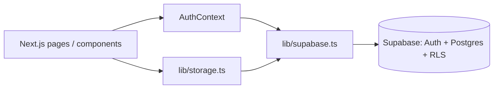

# One Way Out — Architecture & Change Guide

This document maps how the app is built so you can safely change **backend behavior**, **Supabase**, **security**, and the **frontend**. It reflects the codebase as of the project snapshot used to generate it.

---

## 1. High-level architecture

| Layer | What it is |
|-------|------------|
| **Frontend** | Next.js 16 (App Router), React 19, TypeScript, Tailwind CSS 4 |
| **Auth & API** | Supabase Auth + PostgREST (no custom Node API in this repo) |
| **Database** | PostgreSQL in Supabase, with **Row Level Security (RLS)** |
| **“Backend” in code** | There are **no** `app/api/*` route handlers. All data access goes from the browser through `@supabase/supabase-js` using the **anon key** and the user’s JWT. |

**Implication:** Anything that must stay secret (service role keys, third-party secrets that bypass RLS) cannot live only in the browser. Today, sensitive operations are expected to be enforced by **RLS policies** in Supabase, not by a separate server.

---

## 2. Environment & configuration

| Variable | Purpose |
|----------|---------|
| `NEXT_PUBLIC_SUPABASE_URL` | Supabase project URL |
| `NEXT_PUBLIC_SUPABASE_ANON_KEY` | Public anon key (safe to expose in the client; access is limited by RLS) |
| `NEXT_PUBLIC_GOOGLE_CLIENT_ID` | Optional; used by `@react-oauth/google` wrapper. **Supabase Google login** is configured in the Supabase dashboard (redirect URLs, provider toggle), not only this env var |

Templates: `.env.local.example` (copy to `.env.local`, never commit secrets).

The Supabase client is created in `lib/supabase.ts`. It uses placeholder URL/key when env is missing so builds do not fail; `isSupabaseConfigured()` (client-side) gates auth flows with a clear error message.

---

## 3. Supabase: schema, migrations, and where to edit

### 3.1 Migration files (run order matters)

Apply in the Supabase SQL Editor (or Supabase CLI) in **filename order**:

| File | Contents |
|------|----------|
| `supabase/migrations/20250217000000_initial_schema.sql` | `profiles`, `expenses`, `debts`, `assets`, `daily_moods`, `onboarding_data`; RLS; `handle_new_user` trigger |
| `supabase/migrations/20250217100000_income_budget_expenses.sql` | `income`, `budget_expenses` + RLS |
| `supabase/migrations/20260218000000_liabilities.sql` | `liabilities` + RLS |
| `supabase/migrations/20260218000001_update_profile_trigger_phone.sql` | Profile trigger updates (phone metadata) |
| `supabase/migrations/20260218000002_user_points.sql` | `profiles.user_points` |
| `supabase/migrations/20260516021500_signup_rewards_bonus.sql` | Default 100 signup points on `profiles` |
| `supabase/migrations/20260518000000_gamification_rewards.sql` | `reward_transactions`, `task_completions`, `user_gamification`; RPCs `award_task_points`, `redeem_points`, `spin_wheel`, `get_gamification_state`; trigger blocking direct `user_points` updates |
| `supabase/migrations/20260519000000_gamification_points_catalog.sql` | Product points catalog (login 10, mood 20, expense 30, video 100 cap 3/day, onboarding 1500, tier bonuses, etc.) |

**When you change the DB:** add a **new** migration file (do not rewrite old ones on a shared/production DB), then mirror any column renames in `lib/storage.ts` mappers and in `types/index.ts` if needed.

### 3.2 Tables ↔ app code

| Table | Primary access | Notes |
|-------|----------------|-------|
| `profiles` | `id` = `auth.users.id` | Auto-created by trigger; app may `upsert` if missing |
| `expenses` | `user_id` | Text `id` from app |
| `debts` | `user_id` | |
| `assets` | `user_id` | |
| `liabilities` | `user_id` | |
| `income` | `user_id` | |
| `budget_expenses` | `user_id` | Also used for Spend-screen category budgets |
| `daily_moods` | composite `(user_id, date)` | |
| `onboarding_data` | `user_id` | Legacy JSONB; `storage` still reads it as fallback |
| `reward_transactions` | `user_id` | Append-only points ledger (RPC inserts only) |
| `task_completions` | `user_id` | One row per user per task key (daily/weekly keys for recurring tasks) |
| `user_gamification` | `user_id` | Free spin date + spin tokens |

Row shapes use **snake_case** in Postgres; `lib/storage.ts` maps to **camelCase** `UserProfile`, `Expense`, etc.

### 3.3 Single “data layer” file

Almost all Supabase reads/writes live in **`lib/storage.ts`** (`storage` object). That is the first place to change when adding columns, new tables, or query patterns. **`getDashboardData`** batches parallel reads for the dashboard.

**Gamification** (points, tasks, spin wheel): business rules in **`lib/gamification/config.ts`**; Supabase RPC wrappers in **`lib/gamification/rewards.ts`**. UI: **`components/EarnTracker.tsx`**, **`components/SpinWheel.tsx`**, redeem on **`components/SpendTracker.tsx`**. `profiles.user_points` must only change via RPCs (not `saveProfile`).

### Gamification manual QA

1. Apply migration `20260518000000_gamification_rewards.sql` in Supabase.
2. New user: profile shows 100 points; one free spin on `/earn`.
3. Log mood once per day → +25 pts; second log same day does not double-award.
4. Save spend budgets → +50 pts once per ISO week.
5. Record debt payment on Review Debt → +100 pts once; may grant a spin token.
6. Complete course (manual claim on Earn) → +50 pts once.
7. Redeem on Spend → balance decreases; ledger row in `reward_transactions`.
8. Paid spin costs 50 pts; token spin uses `spin_tokens`; free spin once per local calendar day.

---

## 4. Authentication

| Concern | Location |
|---------|----------|
| Session state, sign-in/up, OTP, password reset | `contexts/AuthContext.tsx` |
| “Am I logged in?” for routes | `components/ProtectedRoute.tsx` + `useAuth()` |
| Session helpers (`getUser`, `getSession`) | `lib/storage.ts` |

Supported flows (via Supabase):

- Email + password (`signInWithPassword`, `signUp`)
- Google (`signInWithOAuth({ provider: "google" })`) — configure provider + redirect URLs in Supabase
- Phone SMS OTP (`signInWithOtp`, `verifyOtp`)

Logout calls `supabase.auth.signOut()` and redirects to `/login`.

---

## 5. Security

### 5.1 What protects user data

- **RLS** on all listed tables: policies are of the form `auth.uid() = user_id` (or `id` for `profiles`). See initial migration files.
- **JWT**: Requests from the Supabase client send the user’s session; Postgres evaluates policies per row.

### 5.2 Practices to preserve when changing code

1. **Never** put the **service role** key in `NEXT_PUBLIC_*` or ship it to the browser.
2. New tables must have **RLS enabled** and policies that tie rows to `auth.uid()` (or a safe alternative you document).
3. **`lib/storage.ts`** already scopes deletes/updates with `user_id` where it matters; some `update*` calls only use `id` — RLS still restricts which rows are visible/updatable.
4. **Google**: For Supabase OAuth, set authorized redirect URIs in **Google Cloud** and **Supabase Authentication → URL configuration** to match your deployed origin (e.g. production URL + localhost for dev).

### 5.3 Frontend route protection

- **Client-only**: `ProtectedRoute` redirects to `/login` if not authenticated. This improves UX; **authorization for data** still depends on Supabase RLS.
- For stricter **server-side** checks (e.g. hiding HTML from crawlers or validating cookies on the server), you would add middleware or server components that call `createServerClient` — **not present** in this repo today.

### 5.4 Dependency surface

- `@react-oauth/google` wraps UI that expects `NEXT_PUBLIC_GOOGLE_CLIENT_ID`; actual Supabase Google sign-in uses the Supabase OAuth redirect flow from `AuthContext`.

---

## 6. Frontend map (where to change UI)

### 6.1 App Router (`app/`)

| Path | Role |
|------|------|
| `app/layout.tsx` | Root layout, fonts, **`AuthProvider`** wrapper |
| `app/page.tsx` | Home: `ProtectedRoute` → `OnboardingCheck` → `AppLayout` → `Dashboard` |
| `app/login`, `app/register`, `app/forgot-password`, `app/reset-password` | Auth pages |
| `app/onboarding/page.tsx` | Onboarding |
| Other folders (`expenses`, `debts`, `profile`, `budget`, `spend`, `earn`, `mood`, `insights`, …) | Feature pages — each typically composes a component + `AppLayout` / guards |

Pattern: many routes wrap content with **`ProtectedRoute`** and **`AppLayout`** (sidebar from `Navigation`).

### 6.2 Key components

| Component | Role |
|-----------|------|
| `components/Navigation.tsx` | Sidebar nav |
| `components/AppLayout.tsx` | Shell + sidebar + main |
| `components/Dashboard.tsx` | Dashboard |
| `components/OnboardingCheck.tsx` | Onboarding gate |
| Feature views: `BudgetManager`, `ExpenseList`, `DebtList`, `ProfileForm`, `SpendTracker`, etc. | Call `storage.*` or receive data from parents |

### 6.3 Types

Shared TypeScript models: **`types/index.ts`**. Keep this aligned with DB columns when you extend profiles or entities.

---

## 7. Adding a “real” backend later

If you need server-only logic (webhooks, admin, secrets, aggregations that must not trust the client):

1. Add **Next.js Route Handlers** under `app/api/...` or **Supabase Edge Functions**.
2. Use the **service role** only on the server, never in client bundles.
3. Optionally narrow what the client can do with RLS and/or move some writes behind server endpoints.

Today, the project is intentionally **Supabase-direct from the client** for CRUD.

---

## 8. Quick reference: file → responsibility

| File / area | Change when you want to… |
|-------------|---------------------------|
| `lib/supabase.ts` | Client options, multiple projects, SSR client split |
| `lib/storage.ts` | Queries, new entities, batching, mapping |
| `contexts/AuthContext.tsx` | Auth methods, session shape, new providers |
| `supabase/migrations/*.sql` | Schema, indexes, RLS, triggers |
| `types/index.ts` | TypeScript models |
| `app/**/page.tsx` | Routes, layout composition |
| `components/*` | UI and feature behavior |

---

## 9. Related docs

- **`README.md`** — install, env vars, high-level features.
- **`.env.local.example`** — minimal env template.

When in doubt, search the repo for `supabase.from(` and `storage.` to find all database touchpoints.
